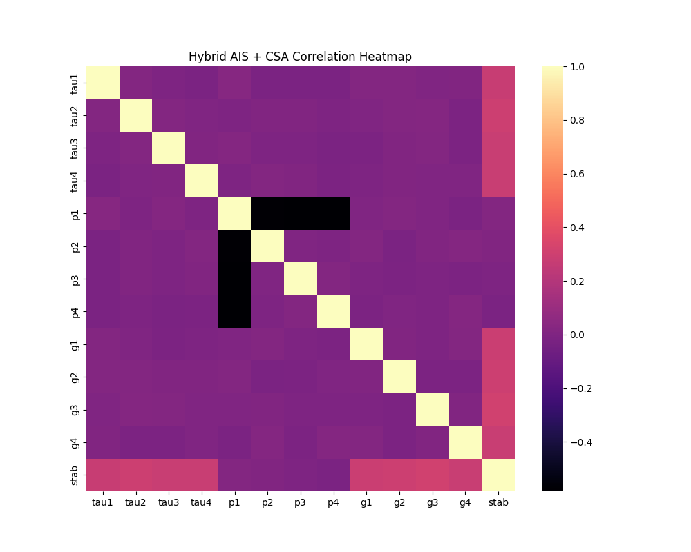

# ⚡ EnergiSense — AI-Powered Smart Grid Load Forecasting & Fault Detection System

### 🌍 Intelligent Load Prediction | Fault Detection | Renewable Energy Optimization

---

## 🧭 Overview

**EnergiSense** is an intelligent deep-learning platform that predicts short-term power demand and detects grid faults using IoT-based sensor data and advanced hybrid optimization.

It combines **AIS (Artificial Immune System)** and **CSA (Cuckoo Search Algorithm)** to fine-tune an **LSTM time-series model**, delivering highly accurate load forecasts and fault-probability insights for smart-city micro-grids.

---

## 🚀 Core Objectives
| Problem | Solution |
|----------|-----------|
| Sudden demand surges 🏙️ | Predict next-hour energy demand with LSTM |
| Transformer overheating 🔥 | Early-warning system via fault-probability scoring |
| Voltage fluctuations ⚡ | Stability detection through hybrid optimization |
| Renewable generation variability 🌤️ | Incorporate solar & wind sensor data |

---

## 🧠 System Architecture
┌───────────────────────────────────────────────┐
│ IoT Smart Meters / Sensors │
│ • Voltage, Current, Power Factor, Temp │
│ • Solar & Wind Feed Data │
└────────────────────────┬──────────────────────┘
│
▼
Data Cleaning & Feature Scaling
│
▼
Hybrid AIS + CSA Optimized LSTM
│
▼
Load & Fault Probability Forecast
│
▼
FastAPI / Streamlit Dashboard

yaml
Copy code

---

## ⚙️ Key Features

| Feature | Description |
|----------|-------------|
| ⚡ **Load Forecasting** | Predicts next-hour / next-day power demand |
| 🧭 **Hybrid AIS + CSA Optimization** | Combines global search (AIS) + local exploration (CSA) |
| 💡 **Fault Detection** | Detects abnormal current/voltage patterns |
| ☀️ **Renewable Integration** | Handles solar & wind feed variability |
| 📊 **Visual Analytics** | Displays forecast curves, error graphs, heatmaps |

---

## 🧾 Dataset

**Input File:**  
`archive/Data_for_UCI_named.csv`  

**Source Example:** [Kaggle – Smart Grid Stability Dataset](https://www.kaggle.com/datasets/pcbreviglieri/smart-grid-stability)

**Typical Columns**
voltage | current | power_factor | temp | humidity | solar_input | wind_speed | stab

yaml
Copy code

---



## 🧮 Modeling Approach

### 1️⃣ Base Model — LSTM
- Learns temporal energy-usage patterns.  
- Input window: last 24 hours → predict next hour.

### 2️⃣ Hybrid AIS + CSA Optimizer
| Phase | Role |
|--------|------|
| **AIS (Artificial Immune System)** | Global exploration of hidden units & dropout rates |
| **CSA (Cuckoo Search Algorithm)** | Fine-tuning of promising solutions via Levy flights |
| **Fusion** | Optimal hyperparameters → final LSTM training |

---

## 📂 Project Structure
Smart Grid Load Forecasting & Fault Detection System/
│
├── archive/
│ └── Data_for_UCI_named.csv
│
├── ais_csa_energi_model.h5 ← Trained LSTM model
├── ais_csa_energi_scaler.pkl ← Feature scalers
├── ais_csa_energi_config.yaml ← Model & optimizer config
│
├── hybrid_ais_csa_train.py ← Training + optimization script
├── hybrid_ais_csa_predict.py ← Prediction + evaluation script
│
├── hybrid_ais_csa_results.csv ← Actual vs Predicted values
├── hybrid_ais_csa_prediction.json ← Summary (JSON output)
│
├── ais_csa_energi_heatmap.png ← Feature correlation heatmap
├── ais_csa_energi_accuracy_graph.png← Training loss plot
├── ais_csa_energi_prediction_graph.png ← Forecast vs Actual
├── ais_csa_energi_result_graph.png ← Metric bar chart
│
└── README.md ← Project documentation

yaml
Copy code

---

## 🧩 Tech Stack
| Layer | Tools |
|--------|-------|
| **Language** | Python 3.11 |
| **Frameworks** | TensorFlow (Keras LSTM), Scikit-learn |
| **Optimization** | Hybrid AIS + CSA |
| **Visualization** | Matplotlib / Seaborn / Plotly |
| **Backend** | FastAPI / Streamlit (optional UI) |
| **Hardware Inputs** | ESP32 Smart Meters, DHT11, INA219 sensors |

---

## 🧰 How to Run

### 1️⃣ Train Model
```bash
python hybrid_ais_csa_train.py
This script:

Loads dataset → cleans & scales

Runs Hybrid PSO + CSA optimization

Trains final LSTM

Saves model + scalers + config + graphs

2️⃣ Generate Predictions
bash
Copy code
python hybrid_ais_csa_predict.py
This script:

Loads trained model + scalers + dataset

Auto-repairs corrupted YAML configs

Generates predictions & metrics

Saves:

hybrid_ais_csa_results.csv

hybrid_ais_csa_prediction.json

Displays Actual vs Predicted curve on screen

📈 Sample JSON Output
json
Copy code
{
  "Hybrid_Model": "AIS + CSA Optimized LSTM",
  "Metrics": {
    "MAE": 2.93,
    "RMSE": 3.71,
    "R2_Score": 0.947
  },
  "Fault_Probability": 0.036,
  "Recommendations": [
    "Grid stable — within safe limits",
    "Expected load deviation ≈ 2.18 units",
    "Recalibrate if RMSE > 5.0"
  ]
}
🧮 Evaluation Metrics
Metric	Description
MAE	Mean Absolute Error — average deviation in kW
RMSE	Root Mean Square Error — forecast variance
R²	Model fit accuracy for regression
Fault Probability	Fraction of samples exceeding 1.5 × RMSE error

📊 Generated Visuals
Graph	File
Loss Curve	ais_csa_energi_accuracy_graph.png
Heatmap	ais_csa_energi_heatmap.png
Prediction Plot	ais_csa_energi_prediction_graph.png
Metrics Bar	ais_csa_energi_result_graph.png


🔒 Error Handling
The prediction script auto-repairs corrupted YAML files containing NumPy or tuple tags.

On first run it regenerates a clean ais_csa_energi_config.yaml.

Ensures model inference never fails due to serialization issues.

🔮 Future Enhancements
Integrate weather and calendar events for contextual forecasting.

Deploy on Raspberry Pi 4 for edge inference.

Add auto-alert system for critical faults.

Implement Reinforcement Learning for dynamic grid control.

Build interactive dashboard via Streamlit + FastAPI.

📚 References
Kaggle Smart Grid Stability Dataset

TensorFlow Keras Documentation

Yang & Deb (2010) – Cuckoo Search via Lévy Flights

de Castro & Timmis (2002) – Artificial Immune Systems

👨‍💻 Author
Sagnik Patra
